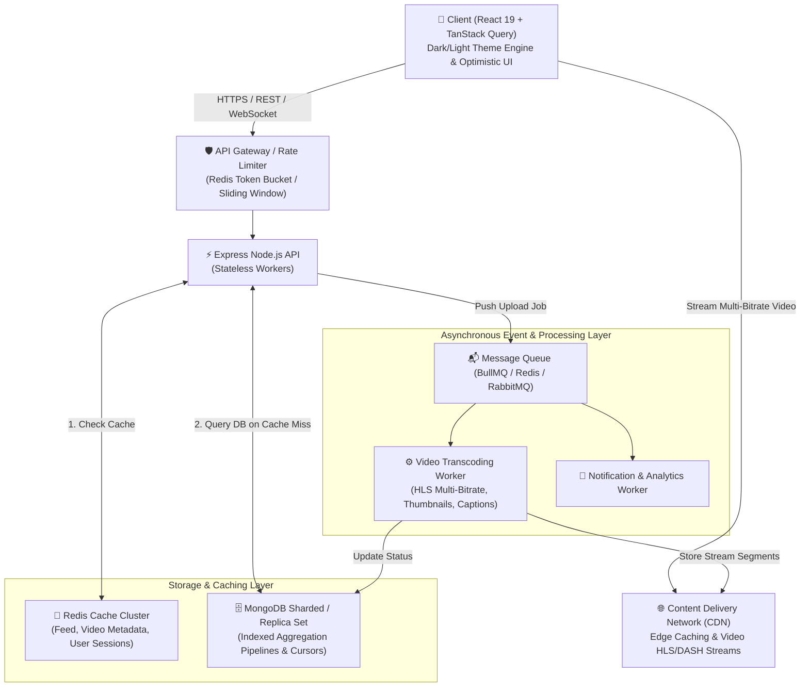

# Playtube v2.0: Design Systems & Professional UI/UX

> We start with **Module 1 — Design Systems** first, then move to **Distributed Systems**.
> Branch: `_feat/playtube-v2`

---

## Brand Identity: Derived from logo.png

The Playtube logo is a rounded-rectangle card with a **blue → purple diagonal gradient** and
a white lightning/play mark. This gradient is the single source of truth for the entire design system.

| Token Role          | Dark Mode                 | Light Mode |
| :------------------ | :------------------------ | :--------- |
| **Brand Start**     | `#4361EE` (Electric Blue) | `#4361EE`  |
| **Brand End**       | `#7B2FBE` (Deep Purple)   | `#7B2FBE`  |
| **Brand Mid**       | `#6B48F0` (Indigo Violet) | `#6B48F0`  |
| **Page Background** | `#0a0c14`                 | `#F5F6FA`  |
| **Surface / Cards** | `#111827`                 | `#FFFFFF`  |
| **Elevated**        | `#1c2333`                 | `#F0F2F8`  |
| **Border**          | `#222d40`                 | `#E2E8F0`  |
| **Text Primary**    | `#F1F5F9`                 | `#0F172A`  |
| **Text Secondary**  | `#94A3B8`                 | `#64748B`  |

**No more cyan accent.** Every accent now uses the brand gradient `from-[#4361EE] to-[#7B2FBE]`.

---

## The Problem with v1.0

Colors and spacing are hardcoded across every component:

```tsx
// Bad v1.0 — impossible to theme or maintain:
<div className="bg-[#0b0f19] border-[#1f293d] text-cyan-400">
```

Impact:

- No dark/light mode toggle
- Brand color change requires editing 20+ files
- No accessibility focus rings
- No consistent spacing grid

---

## The Solution: Design Token Architecture

```tsx
// Good v2.0 — semantic, theme-aware, maintainable:
<div className="bg-bg-surface border-border-subtle text-brand-start">
```

---

## Implementation: 5 Phases

### Phase 1 — Token Foundation

**Files:** `tailwind.config.js`, `src/index.css`

- Add `darkMode: "class"` to Tailwind
- Define brand color palette (start/mid/end)
- Map CSS custom properties → Tailwind semantic utilities
- Add `backgroundImage: brand-gradient`
- Switch font from system default to **Inter** (Google Fonts)
- Global `*:focus-visible` ring using `ring-brand-mid`
- Scrollbar tinted with brand blue

### Phase 2 — ThemeProvider Context

**Files:** `src/context/ThemeContext.tsx` _(NEW)_, `src/main.tsx`

- Read `localStorage("theme")` or `prefers-color-scheme` on first load
- Toggle adds/removes `dark` class on `<html>`
- `useTheme()` hook: `{ theme, toggle }`
- Wrap app in `<ThemeProvider>` in `main.tsx`

### Phase 3 — Navbar + Sidebar Refactor

**Files:** `Navbar.tsx`, `Sidebar.tsx`

- Add Sun/Moon dark/light toggle button to Navbar
- All hardcoded colors → semantic tokens
- Sign In button: brand gradient instead of cyan
- Sidebar active state: brand gradient soft-glow instead of cyan

### Phase 4 — Page & Card Refactor

**Files:** All pages + `VideoCard.tsx`

| Old Class                   | New Token                       |
| :-------------------------- | :------------------------------ |
| `bg-[#0b0f19]`              | `bg-bg-primary`                 |
| `bg-[#131a2a]`              | `bg-bg-surface`                 |
| `bg-[#1f293d]`              | `bg-bg-elevated`                |
| `border-[#1f293d]`          | `border-border-subtle`          |
| `text-gray-100`             | `text-text-primary`             |
| `text-gray-400`             | `text-text-secondary`           |
| `text-cyan-400`             | `text-brand-start`              |
| `from-cyan-500 to-blue-600` | `from-brand-start to-brand-end` |

VideoCard extra: hover lift animation `group-hover:-translate-y-1 duration-200`

### Phase 5 — Micro-animations + AuthRequiredPopup

**File:** `AuthRequiredPopup.tsx`

- Icon container: brand gradient
- Sign in button: brand gradient
- Entry: `slide-in-from-bottom-2` animation

---

## Testing Checklist

- [ ] Dark mode: no leftover hardcoded hex values
- [ ] Light mode: text contrast ≥ 4.5:1 (WCAG AA)
- [ ] Theme toggle persists across page refresh (localStorage)
- [ ] System `prefers-color-scheme` respected on first load
- [ ] All interactive elements show focus rings on Tab navigation
- [ ] Brand gradient appears on: Sign In, Subscribe, Like, active nav item
- [ ] Logo renders correctly in both modes
- [ ] Auth sign in / register flow works end-to-end
- [ ] VideoCard hover animation is smooth (no layout shift)
- [ ] Mobile responsive layout unchanged

---

## Files Touched

| File                                   | Change                                      |
| :------------------------------------- | :------------------------------------------ |
| `tailwind.config.js`                   | Brand tokens, dark mode class, gradients    |
| `src/index.css`                        | CSS vars, Inter font, focus ring, scrollbar |
| `src/context/ThemeContext.tsx`         | **NEW**                                     |
| `src/main.tsx`                         | ThemeProvider wrapper                       |
| `src/App.tsx`                          | Semantic HTML                               |
| `src/components/Navbar.tsx`            | Tokens + theme toggle                       |
| `src/components/Sidebar.tsx`           | Tokens + brand active state                 |
| `src/components/VideoCard.tsx`         | Tokens + hover lift                         |
| `src/components/AuthRequiredPopup.tsx` | Brand gradient + slide-in                   |
| `src/pages/*.tsx` (all)                | Token color replacements                    |

---

> Once this phase passes all checklist items → **Module 2: Redis Cache-Aside (Distributed Systems)**

First of all, huge congratulations on building Playtube from scratch! Building a full-stack video platform using Express, MongoDB aggregation pipelines, Cloudinary, JWT authentication, React 19, and TanStack Query is no small feat. You already have a strong, functional foundation.

Now, we are taking on the mindset of a Senior Principal Systems Architect and Lead Product Designer. To evolve Playtube into an enterprise-grade platform capable of handling real-world scale and delivering a delightful user experience, we will master three core engineering pillars:

1. **Distributed Systems & Backend Scalability** (Handling concurrency, async background jobs, caching, and database performance).
2. **Design Systems & Professional UI/UX** (Dynamic Dark/Light mode, tokenized spacing/color hierarchies, and micro-animations).
3. **Accessibility (a11y) & High-Performance Delivery** (Keyboard navigation, screen-reader readiness, optimistic UI, and zero-jank data loading).

---

## 1. Distributed Systems Architecture: Where We Are vs. Where We're Going

Right now, Playtube v1.0 operates as a classic Synchronous Monolith. When a user uploads a video or requests feed data, the Express server directly handles the heavy lifting and talks to a single MongoDB instance.

### The Problem at Scale (100,000+ Concurrent Users):

- **Thread Blocking on Video Uploads:** Uploading multi-megabyte video files directly inside an API request (`multer` -> Cloudinary) holds API connections open, starving Node.js event loop threads and causing high latency for normal users.
- **Database Bottlenecks & Aggregation Costs:** Running complex multi-lookup `$lookup` aggregation pipelines on unindexed or large collections on every single page load will quickly spike MongoDB CPU to 100%.
- **Pagination Collapse:** Traditional `skip()` and `limit()` pagination slows down exponentially as collections grow into millions of documents (`skip(1000000)` forces Mongo to scan and discard 1M documents!).

### The Playtube v2.0 Distributed Architecture

Here is the system architecture we will build together to solve these challenges:



---

## Core Distributed Systems Concepts We Will Implement

1. **Asynchronous Background Processing (BullMQ + Redis)**
   - **Why:** When a user uploads a 4K video, the API should simply save the raw file to object storage (AWS S3 / Cloudinary raw), push a job `{ videoId, userId, filePath }` to a Message Queue, and immediately respond `202 Accepted` ("Processing started").
   - **How:** Background workers pick up the job independently to generate HLS (HTTP Live Streaming) `.m3u8` playlists (for adaptive bitrate streaming like 360p, 720p, 1080p), extract thumbnail sprites, and update the database when ready.
2. **Multi-Layer Caching (Redis Cache-Aside Pattern)**
   - **Why:** Video details (`GET /videos/:id`), comments, and subscriber counts are read 1,000x more often than they are written.
   - **How:** When a user requests a video:
     - Check Redis (`GET video:details:123`). If present, return immediately (< 2ms latency).
     - If missing, run our Mongoose aggregation pipeline, store the result in Redis with a TTL (`SETEX video:details:123 3600 ...`), and return.
     - **Cache Invalidation:** When the creator edits the video or gets a new like, we invalidate or update the cached key (`DEL video:details:123`).
3. **Cursor-Based Pagination vs. Skip/Limit**
   - **Why:** In your current feed and search endpoints, `skip(page * limit)` is $O(N)$ and scans all previous records.
   - **How:** We will implement Cursor-Based Pagination using encoded timestamps/IDs (`?cursor=eyJjcmVhdGVkQXQiOiIyMDI2LTA3LTEy...`). This turns $O(N)$ database scans into $O(1)$ index lookups (`{ _id: { $lt: cursorId } }`), providing lightning-fast infinite scroll regardless of database size.
4. **Distributed Rate Limiting (Sliding Window Log / Token Bucket)**
   - **Why:** Protect login and comment endpoints from DDoS attacks, credential stuffing, and bot spamming.
   - **How:** Using Redis atomics (`MULTI/EXEC` or Lua scripts) to track request frequencies per IP or `userId`.

---

## 2. Professional UI/UX, Design Tokens & Spacing Strategy

Looking at your current `Navbar.tsx` and `App.tsx`, we have hardcoded colors like `bg-[#0b0f19]`, `bg-[#131a2a]`, and `border-[#1f293d]`. While this creates a nice dark look initially, it prevents Theme Flexibility (Dark/Light mode) and makes consistent design maintenance hard.

### A. The Theme Token Architecture (CSS Variables + Tailwind)

Instead of hardcoding hex values across hundreds of components, we will build a Design Token System in `index.css` and `tailwind.config.js`:

```css
/* src/index.css */
@layer base {
  :root {
    /* Light Mode Tokens (as raw RGB for opacity modifier support) */
    --bg-primary: 248 250 252; /* Slate 50 */
    --bg-surface: 255 255 255; /* White */
    --bg-elevated: 241 245 249; /* Slate 100 */
    --text-primary: 15 23 42; /* Slate 900 */
    --text-secondary: 100 116 139; /* Slate 500 */
    --border-subtle: 226 232 240; /* Slate 200 */
    --accent-primary: 6 182 212; /* Cyan 500 */
  }

  .dark {
    /* Dark Mode Tokens */
    --bg-primary: 11 15 25; /* #0b0f19 */
    --bg-surface: 19 26 42; /* #131a2a */
    --bg-elevated: 31 41 61; /* #1f293d */
    --text-primary: 243 244 246; /* Gray 100 */
    --text-secondary: 156 163 175; /* Gray 400 */
    --border-subtle: 31 41 61; /* #1f293d */
    --accent-primary: 0 242 254; /* Accent Cyan */
  }
}
```

To bind these tokens to Tailwind, we extend `tailwind.config.js` to map these dynamic CSS variables:

```javascript
// tailwind.config.js
/** @type {import('tailwindcss').Config} */
export default {
  content: ["./index.html", "./src/**/*.{js,ts,jsx,tsx}"],
  darkMode: "class", // Enables class-based dark mode toggling
  theme: {
    extend: {
      colors: {
        primary: "rgb(var(--bg-primary) / <alpha-value>)",
        surface: "rgb(var(--bg-surface) / <alpha-value>)",
        elevated: "rgb(var(--bg-elevated) / <alpha-value>)",
        brand: {
          primary: "rgb(var(--accent-primary) / <alpha-value>)",
        },
        text: {
          primary: "rgb(var(--text-primary) / <alpha-value>)",
          secondary: "rgb(var(--text-secondary) / <alpha-value>)",
        },
        border: {
          subtle: "rgb(var(--border-subtle) / <alpha-value>)",
        },
      },
    },
  },
  plugins: [],
};
```

Then in components, we simply write `bg-surface text-text-primary border-border-subtle hover:text-brand-primary`—and switching themes happens instantly without re-rendering components!

### B. Spacing Hierarchy & Grid Strategy (The 4pt / 8pt Grid System)

Professional UI design relies on strict mathematical rhythms:

- **Micro-spacing (2px, 4px, 6px, 8px):** Used inside components (e.g., gap between an avatar and username, or icon and text inside a button: `gap-2 px-3 py-1.5`).
- **Component-spacing (12px, 16px, 20px, 24px):** Used between cards, form fields, and sidebar items (`gap-4 p-4 rounded-2xl`).
- **Layout-spacing (32px, 48px, 64px):** Used for section margins, container padding, and page headers (`py-8 lg:py-12 gap-8`).

### C. Accessibility (a11y) Best Practices

- **Focus Management:** Every interactive element must have visible, high-contrast focus rings (`focus-visible:outline-none focus-visible:ring-2 focus-visible:ring-cyan-500 focus-visible:ring-offset-2`).
- **Semantic Roles & ARIA:** Using `<nav aria-label="Main Navigation">`, `<main role="main">`, and `aria-expanded` on search and dropdown toggles.
- **Keyboard Navigation:** Ensuring users can tab through video cards, press Space or K to pause video playback, and Esc to close search dropdowns or modals.

---

## 3. Performance Engineering Checklist

We will optimize both client and server performance:

1. **Zero-Jank Debounced Search:** Currently, typing in your search bar triggers instant state updates. We will implement a custom `useDebounce(searchQuery, 300)` hook so we only hit the backend API after the user pauses typing for 300ms.
2. **Optimistic UI Updates:** When a user clicks Like on a video or Subscribe to a channel, we won't wait for the backend roundtrip (200ms+) to update the UI button. We will use TanStack Query's `onMutate` to update the state instantly (0ms latency), and rollback automatically only if the API call fails.
3. **Skeleton Loading Screens:** Replacing generic loading spinners (`Loader2`) with shimmer Skeleton cards (`<VideoCardSkeleton />`) that match the exact geometry of our video layout.

---

## Our Interactive Learning & Implementation Roadmap

To make sure you learn the theory and practice behind every single line of code, I've designed 4 Learning Modules. Where would you like us to start first?

### Module 1: Enterprise UI/UX, Theme Engine & Dark/Light Mode

- **What we build:** Refactor `index.css`, `tailwind.config.js`, and build a `ThemeProvider` context with persistence (`localStorage` & system preferences).
- **Refactoring:** Convert `Navbar.tsx`, `Sidebar.tsx`, and `VideoCard.tsx` to use our new semantic design tokens, clean spacing hierarchy, and full keyboard accessibility (`aria-*` & focus rings).

### ⚡ Module 2: High-Performance Caching (Redis Cache-Aside Engine)

- **What we build:** Integrate `ioredis` into the Express backend.
- **Implementation:** Build a reusable `cacheMiddleware(ttl)` and apply it to heavy MongoDB aggregation endpoints (`/videos/:id`, `/tweets`, channel profiles). Build smart cache invalidation on mutations (like, comment).

### Module 3: Cursor-Based Infinite Scroll (Backend + Frontend)

- **What we build:** Replace skip/limit inside `video.controller.js` and `comment.controller.js` with $O(1)$ cursor-based pagination using `$match: { _id: { $lt: cursor } }`.
- **Frontend:** Implement TanStack Query's `useInfiniteQuery` alongside `IntersectionObserver` (`useInView`) for butter-smooth infinite scrolling on the home feed.

### Module 4: Asynchronous Video Processing Architecture (Redis + BullMQ)

- **What we build:** Set up a background task queue (`BullMQ`) in Node.js.
- **Implementation:** Decouple video upload from video processing. Create a background worker that processes uploads, extracts metadata/thumbnails, and updates MongoDB asynchronously with real-time status polling.
